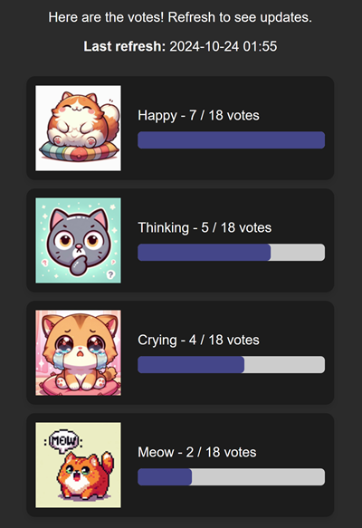

# Homework - cat votes

Один добрый и пушистый заказчик попросил у твоей команды сделать простенький сайт. Цель сайта - во время конференции развернуть веб-приложение, собрать голоса и подвести статистику голосов. Никакой базы данных, достаточно оперативной памяти приложения.

До тебя поработали бэкендер и фронтендер. Основа сайта готова. Проверь как она работает.




### 1 - Подготовка

Создай виртуальное окружение:

```bash
python -m venv venv
```

Активируй его:

```bash
venv/Scripts/activate
```

Установи зависимости:

```bash
pip install -r requirements.txt
```

Запусти сервер FastAPI через uvicorn в режиме разработки - с помощью `reload` обновления в коде будут учитываться автоматически, не надо будет перезапускать веб-сервер:

```bash
uvicorn main:app --reload
```

И пройди по ссылке, которую даст uvicorn. Когда нажмёшь на одну из опций ответа - тебя должно будет перебросить на страницу с результатами.

### 2 - страница с вопросами

Пора поразить всех своей техно-магией! Дизайнер все карточки с вопросами сделал одной фиксированной страницей. Исправь шаблон [choice](templates/choice.html) так, чтобы задействовать jinja цикл `for`.

Найди между карточками вопросов общее и чем они отличаются. Внутри функции `get_choice` добавь необходимые данные в словарь `data` чтобы jinja-шаблон мог к нужным переменным обращаться.

По результатам этого этапа страница с вопросами должна корректно загружаться и после ответа перенаправлять на страницу ответов.

### 3 - учёт голосов

После выбора варианта ответа запрос пользователя приходит в функцию `count_vote`. Сейчас эта функция только печатает короткое имя ответа. Сделай так, чтобы статистика ответов сохранялась в оперативную память приложения.

### 4 - страница результатов

Страница результатов сейчас тоже фиксированная. Добавь магии шаблонов и кода в функцию `get_stats` чтобы страница "ожила".

* дата и время последнего обновления страницы показывают правильное время
* на каждой карточке правильно отражается количество голосов из общего количества голосов
* карточки отсортированы по количеству голосов по убыванию
* закраска шкалы по количеству голосов: за 100% принимай наибольшее количество голосов среди карточек, если никто ещё не голосовал - поставь 0%.

### 5 - как сдать домашку

Сделай форк этого репозитория, закоммить свои изменения и пришли ссылку на репозиторий в гугл-форму с домашками.
